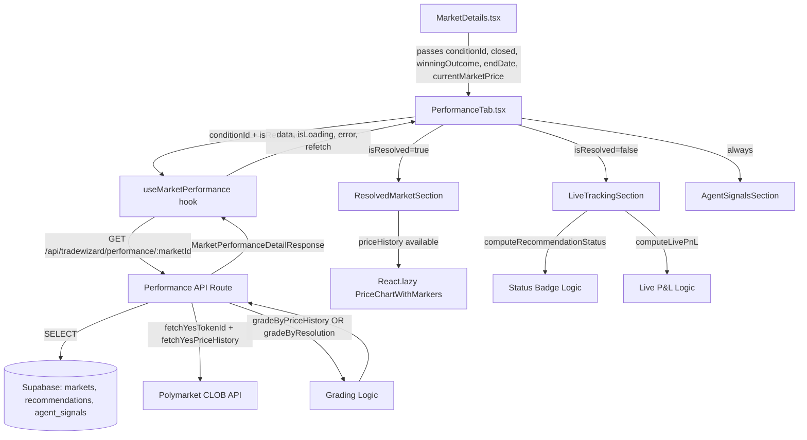

# Design Document: AI Recommendation Performance Tab

## Overview

The AI Recommendation Performance Tab adds a "Performance" tab to the market details page (`/market/[slug]`). It surfaces how the multi-agent AI system's trade recommendations have performed against real Polymarket price movements — for both active markets (live unrealized P&L tracking) and resolved markets (final graded results with price chart).

The previous implementation was reverted due to issues with the hook not differentiating active vs. resolved markets, the component using the API's `roiRealized: 0` placeholder for active markets instead of computing live P&L from `currentMarketPrice`, and missing stale-time / refetch configuration for active markets. This design addresses all of those root causes explicitly.

### Key Design Decisions

1. **Single hook, two modes**: `useMarketPerformance` is extended with an `isResolved` flag that controls `staleTime`, `refetchInterval`, and `refetchOnWindowFocus`. The API already handles both market states; the hook just needs the right cache settings.

2. **Live P&L computed client-side**: For active markets, `roiRealized` from the API is always `0` (a placeholder). The component computes unrealized P&L from `currentMarketPrice` prop using the same formula as the API's grading logic. This is the critical correctness fix.

3. **Lazy-loaded chart**: The `PriceChartWithMarkers` component (which pulls in Recharts) is lazy-loaded via `React.lazy` + `Suspense` so it doesn't inflate the initial bundle for users who never open the Performance tab.

4. **ErrorBoundary isolation**: The entire tab is wrapped in the existing `ErrorBoundary` component so a rendering crash in the Performance tab cannot propagate to the rest of `MarketDetails`.

5. **No new API routes**: The existing `/api/tradewizard/performance/[marketId]` route already handles both active and resolved markets correctly. Only the hook and component need changes.

---

## Architecture



### Component Tree

```
MarketDetails.tsx                    ← modified: adds 'performance' tab + passes props
└── PerformanceTab.tsx               ← modified: full rewrite of existing file
    ├── ErrorBoundary                ← existing shared component
    ├── LoadingState                 ← existing shared component (skeleton)
    ├── ErrorState                   ← existing shared component (with retry)
    ├── EmptyState                   ← existing shared component
    ├── LiveTrackingSection          ← new sub-component (active markets)
    │   └── RecommendationStatusBadge ← new sub-component
    ├── ResolvedMarketSection        ← new sub-component (resolved markets)
    │   ├── MarketResolutionCard     ← new sub-component
    │   ├── ROIMetrics               ← existing Performance component
    │   ├── AccuracyMetrics          ← existing Performance component
    │   ├── ConfidenceBreakdownTable ← new sub-component
    │   └── Suspense + PriceChartWithMarkers ← existing, lazy-loaded
    └── AgentSignalsSection          ← new sub-component
```

---

## Components and Interfaces

### Files to Modify

| File | Change |
|------|--------|
| `components/Trading/Markets/MarketDetails.tsx` | Add `'performance'` to `TabType`, add tab to `tabs` array, render `<PerformanceTab>` with correct props |
| `components/Trading/Markets/PerformanceTab.tsx` | Full rewrite — see design below |
| `hooks/useMarketPerformance.ts` | Add `isResolved` param, fix staleTime/refetchInterval/refetchOnWindowFocus |

### Files to Create

| File | Purpose |
|------|---------|
| `components/Trading/Markets/LiveTrackingSection.tsx` | Active market live P&L and status badges |
| `components/Trading/Markets/ResolvedMarketSection.tsx` | Resolved market graded results |
| `components/Trading/Markets/RecommendationStatusBadge.tsx` | Status badge for active market recommendations |
| `components/Trading/Markets/ConfidenceBreakdownTable.tsx` | Confidence-level accuracy breakdown |
| `components/Trading/Markets/AgentSignalsSection.tsx` | Agent signal cards grid |

### PerformanceTab Props Interface

```typescript
interface PerformanceTabProps {
  conditionId: string | null;
  isResolved: boolean;          // market.closed === true
  winningOutcome?: string;      // market.winningOutcome
  endDate?: string;             // market.endDate
  currentMarketPrice: number;   // live YES token price from MarketDetails
}
```

### Updated useMarketPerformance Hook Signature

```typescript
export function useMarketPerformance(
  marketId: string | null,
  options: UseMarketPerformanceOptions = {}
)

export interface UseMarketPerformanceOptions {
  enabled?: boolean;
  isResolved?: boolean;  // NEW: controls cache behavior
}
```

Cache behavior based on `isResolved`:
- `isResolved: true` → `staleTime: 10 * 60 * 1000`, `refetchInterval: false`, `refetchOnWindowFocus: false`
- `isResolved: false` → `staleTime: 60 * 1000`, `refetchInterval: 60 * 1000`, `refetchOnWindowFocus: true`

### MarketDetails Tab Integration

```typescript
// TabType extension
type TabType = 'overview' | 'ai-insights' | 'debate' | 'data-flow' | 'chart' | 'time-travel' | 'performance';

// Tab entry added to tabs array (always shown)
{ id: 'performance', label: 'Performance', icon: BarChart3 }

// Render in tab content area
{activeTab === 'performance' && (
  <PerformanceTab
    conditionId={market.conditionId || null}
    isResolved={market.closed}
    winningOutcome={market.winningOutcome}
    endDate={market.endDate}
    currentMarketPrice={yesPrice}
  />
)}
```

---

## Data Models

### Extended MarketPerformanceDetailResponse (no API changes needed)

The existing `MarketPerformanceDetailResponse` interface in `useMarketPerformance.ts` already covers all fields. The key fields used by the new component:

```typescript
// From existing interface — reproduced here for clarity
export interface RecommendationWithOutcome {
  id: string;
  direction: "LONG_YES" | "LONG_NO" | "NO_TRADE";
  confidence: "high" | "moderate" | "low";
  fairProbability: number;
  marketEdge: number;
  entryZoneMin: number;
  entryZoneMax: number;
  targetZoneMin?: number | null;
  targetZoneMax?: number | null;
  stopLoss?: number | null;
  explanation: string;
  createdAt: string;
  actualOutcome: string;        // "Pending" for active, "YES"/"NO" for resolved
  wasCorrect: boolean;          // false for active (placeholder)
  roiRealized: number;          // 0 for active (placeholder — compute live P&L instead)
  exitTimestamp?: string | null;
  gradedByPriceHistory?: boolean;
}
```

### Recommendation Status (Active Markets)

```typescript
type RecommendationStatus =
  | "in-entry-zone"
  | "above-target"
  | "below-stop"
  | "between-entry-and-target"
  | "pending";

interface StatusBadgeConfig {
  label: string;
  colorClass: string;
  bgClass: string;
}

const STATUS_BADGE_MAP: Record<RecommendationStatus, StatusBadgeConfig> = {
  "in-entry-zone":            { label: "In Entry Zone",   colorClass: "text-blue-400",   bgClass: "bg-blue-500/20" },
  "above-target":             { label: "Target Reached",  colorClass: "text-emerald-400", bgClass: "bg-emerald-500/20" },
  "below-stop":               { label: "Stop Hit",        colorClass: "text-red-400",    bgClass: "bg-red-500/20" },
  "between-entry-and-target": { label: "Tracking",        colorClass: "text-yellow-400", bgClass: "bg-yellow-500/20" },
  "pending":                  { label: "Pending",         colorClass: "text-gray-400",   bgClass: "bg-gray-500/20" },
};
```

### Live P&L Computation

```typescript
// Computed client-side from currentMarketPrice prop
// NOT from rec.roiRealized (which is 0 for active markets)

function computeLivePnL(
  rec: RecommendationWithOutcome,
  currentYesPrice: number
): number | null {
  if (rec.direction === "NO_TRADE") return null;
  if (!isFinite(rec.entryZoneMin) || !isFinite(rec.entryZoneMax)) return null;

  const entryMid = (rec.entryZoneMin + rec.entryZoneMax) / 2;
  if (entryMid === 0) return null;

  if (rec.direction === "LONG_YES") {
    return ((currentYesPrice - entryMid) / entryMid) * 100;
  } else {
    // LONG_NO: trader holds NO token
    const noEntry = 1 - entryMid;
    const noCurrent = 1 - currentYesPrice;
    if (noEntry === 0) return null;
    return ((noCurrent - noEntry) / noEntry) * 100;
  }
}
```

### Recommendation Status Computation

```typescript
function computeRecommendationStatus(
  rec: RecommendationWithOutcome,
  currentYesPrice: number
): RecommendationStatus {
  if (rec.direction === "NO_TRADE") return "pending";
  if (!isFinite(currentYesPrice) || currentYesPrice <= 0) return "pending";
  if (!isFinite(rec.entryZoneMin) || !isFinite(rec.entryZoneMax)) return "pending";

  const { entryZoneMin, entryZoneMax, targetZoneMin, targetZoneMax, stopLoss } = rec;

  if (rec.direction === "LONG_YES") {
    if (targetZoneMin != null && currentYesPrice >= targetZoneMin) return "above-target";
    if (stopLoss != null && currentYesPrice <= stopLoss) return "below-stop";
    if (currentYesPrice >= entryZoneMin && currentYesPrice <= entryZoneMax) return "in-entry-zone";
    if (currentYesPrice > entryZoneMax) return "between-entry-and-target";
    return "pending";
  } else {
    // LONG_NO: target is when YES price falls to target_zone_max or below
    if (targetZoneMax != null && currentYesPrice <= targetZoneMax) return "above-target";
    if (stopLoss != null && currentYesPrice >= stopLoss) return "below-stop";
    if (currentYesPrice >= entryZoneMin && currentYesPrice <= entryZoneMax) return "in-entry-zone";
    if (currentYesPrice < entryZoneMin) return "between-entry-and-target";
    return "pending";
  }
}
```

### Confidence Breakdown (memoized)

```typescript
interface ConfidenceLevelStats {
  total: number;
  correct: number;
  percentage: number;
}

// Derived from data.metrics.accuracy.byConfidence
// Rows with total === 0 are omitted from the table
```

### Numeric Field Display Helper

```typescript
function formatPrice(value: unknown): string {
  if (value == null || !isFinite(Number(value))) return "N/A";
  return Number(value).toFixed(2);
}

function formatProbability(value: unknown): string {
  if (value == null || !isFinite(Number(value))) return "N/A";
  return `${(Number(value) * 100).toFixed(1)}%`;
}

function formatROI(value: unknown): string {
  if (value == null || !isFinite(Number(value))) return "N/A";
  const n = Number(value);
  return `${n >= 0 ? "+" : ""}${n.toFixed(2)}%`;
}
```

---

## Correctness Properties

*A property is a characteristic or behavior that should hold true across all valid executions of a system — essentially, a formal statement about what the system should do. Properties serve as the bridge between human-readable specifications and machine-verifiable correctness guarantees.*

### Property Reflection

Before listing properties, redundancy is eliminated:

- Requirements 12.2, 12.3, 12.4 (parse entryZoneMin, targetZoneMin, stopLoss as numbers, show N/A if null/NaN) are all subsumed by Requirement 12.5 (apply `isFinite` to ALL numeric fields). A single property covers all of them.
- Requirements 3.4–3.7 (Target Reached / Stop Hit indicators for LONG_YES and LONG_NO) are specific cases of the status computation property (Req 9.1). They are covered as edge cases within that property's generator.
- Requirements 4.3 (Intraday badge) and 4.7 (omit zero-count confidence rows) are edge cases of the broader rendering properties 4.2 and 4.6 respectively.
- Requirements 2.8 and 2.9 (staleTime / refetchInterval) are configuration examples, not universal properties. They are kept as examples.
- Requirement 11.7 (live P&L from currentMarketPrice, not API placeholder) is the most critical correctness property and is kept as a standalone property.

---

### Property 1: Active market API response shape

*For any* active market (status != 'resolved') that has at least one recommendation, the Performance API response SHALL contain recommendations where every item has `actualOutcome === "Pending"`, `wasCorrect === false`, and `roiRealized === 0`.

**Validates: Requirements 2.4**

---

### Property 2: Resolved market grading uses price history when available

*For any* resolved market recommendation where price history is available and the target or stop-loss threshold was crossed after the recommendation's `createdAt` timestamp, the graded result SHALL have `gradedByPriceHistory === true` and `wasCorrect` SHALL reflect whether the target (not stop) was hit first.

**Validates: Requirements 2.5**

---

### Property 3: CLOB API failure does not fail the request

*For any* resolved market where the CLOB API returns an error or empty history, the Performance API SHALL still return HTTP 200 with recommendations graded by resolution outcome, and `priceHistory` SHALL be an empty array.

**Validates: Requirements 2.7**

---

### Property 4: Live P&L is computed from currentMarketPrice, not API placeholder

*For any* active market recommendation with direction LONG_YES or LONG_NO and a valid `currentMarketPrice`, the displayed unrealized P&L SHALL equal `computeLivePnL(rec, currentMarketPrice)` and SHALL NOT equal `rec.roiRealized` (which is always 0 for active markets).

**Validates: Requirements 11.7, 3.2**

---

### Property 5: Recommendation status computation is correct for all price zones

*For any* LONG_YES recommendation with valid entry/target/stop zones and any current YES price:
- If `currentYesPrice >= targetZoneMin` → status is `"above-target"`
- If `currentYesPrice <= stopLoss` → status is `"below-stop"`
- If `entryZoneMin <= currentYesPrice <= entryZoneMax` → status is `"in-entry-zone"`
- If `currentYesPrice > entryZoneMax` and below target → status is `"between-entry-and-target"`

And symmetrically for LONG_NO (inverted YES price logic).

**Validates: Requirements 9.1, 3.3, 3.4, 3.5, 3.6, 3.7**

---

### Property 6: NO_TRADE recommendations are excluded from all aggregate calculations

*For any* set of recommendations that includes NO_TRADE items, the accuracy percentage, ROI total, ROI average, best ROI, and worst ROI SHALL be computed only over the non-NO_TRADE subset. If all recommendations are NO_TRADE, the metrics section SHALL show "No tradeable recommendations".

**Validates: Requirements 3.10, 5.8, 11.6**

---

### Property 7: Recommendation card count matches API array length

*For any* API response containing N recommendations, the rendered component SHALL display exactly N recommendation cards (including NO_TRADE ones).

**Validates: Requirements 12.1**

---

### Property 8: Non-finite numeric fields display "N/A"

*For any* recommendation field that is `null`, `undefined`, `NaN`, `Infinity`, or `-Infinity`, the rendered display value SHALL be the string `"N/A"` rather than a numeric string or empty string.

**Validates: Requirements 12.2, 12.3, 12.4, 12.5, 5.5**

---

### Property 9: ROI formatting is consistent with API rounding

*For any* ROI value returned by the API (already rounded to 2 decimal places via `Math.round(roi * 100) / 100`), the displayed string SHALL be formatted as `+X.XX%` or `-X.XX%` with exactly 2 decimal places.

**Validates: Requirements 11.1**

---

### Property 10: Probability formatting is consistent

*For any* probability value `p` in [0, 1], the displayed string SHALL be `(p * 100).toFixed(1) + "%"` — exactly 1 decimal place with a percent sign.

**Validates: Requirements 11.2**

---

### Property 11: Confidence breakdown omits zero-count levels

*For any* set of recommendations, the confidence breakdown table SHALL contain exactly the rows for confidence levels that have at least one tradeable (non-NO_TRADE) recommendation. Levels with zero recommendations SHALL NOT appear.

**Validates: Requirements 4.6, 4.7**

---

### Property 12: Price chart reference lines match recommendation zones

*For any* recommendation rendered on the price chart, the chart SHALL contain a horizontal reference line at the entry zone midpoint `(entryZoneMin + entryZoneMax) / 2`, a line at the target zone midpoint `(targetZoneMin + targetZoneMax) / 2`, and a line at `stopLoss`. All three SHALL be present when the values are finite.

**Validates: Requirements 6.2**

---

### Property 13: Chart axis formatters are correct

*For any* timestamp value `t` (Unix ms), the x-axis formatter SHALL return a human-readable date string. *For any* price value `p` in [0, 1], the y-axis formatter SHALL return `Math.round(p * 100) + "¢"`.

**Validates: Requirements 6.8**

---

## Error Handling

### API Layer (`/api/tradewizard/performance/[marketId]`)

| Scenario | Behavior |
|----------|----------|
| `marketId` missing | 400 Bad Request |
| Market not in Supabase `markets` table | 404 Not Found |
| Recommendations query fails | 500 Internal Server Error |
| No recommendations found | 404 (existing behavior — component shows empty state) |
| CLOB API unavailable | Continue; grade by resolution; `priceHistory: []` |
| CLOB returns empty history | Continue; grade by resolution; `priceHistory: []` |
| Agent signals query fails | Log warning; return `agentSignals: []` |

### Hook Layer (`useMarketPerformance`)

| Scenario | Behavior |
|----------|----------|
| `marketId` is null/undefined | Query disabled; no fetch |
| HTTP 404 | Error thrown; component shows error state |
| HTTP 500 | Error thrown; component shows error state with retry |
| Network timeout | Retry up to 2 times with exponential backoff |

### Component Layer (`PerformanceTab`)

| Scenario | Behavior |
|----------|----------|
| `conditionId` is null | Render empty state immediately; no hook call |
| `isLoading` | Render loading skeleton |
| `error` | Render `<ErrorState>` with retry button calling `refetch()` |
| Empty recommendations array | Render `<EmptyState>` with "No AI Analysis Available" |
| All recommendations are NO_TRADE | Render list; show "No tradeable recommendations" in metrics area |
| `entryZoneMin === 0 && entryZoneMax === 0` | Show "N/A" for price fields; show data quality warning banner |
| `priceHistory` empty on resolved market | Show "Price chart unavailable" notice; omit chart |
| Rendering crash in any child | `ErrorBoundary` catches it; shows fallback UI; rest of page unaffected |

---

## Testing Strategy

### Overview

The frontend has no test framework currently configured (confirmed by `scripts/validate-frontend-implementation.md`). The testing strategy specifies what to add and how to structure tests once Vitest is configured.

**Recommended setup**: Add `vitest`, `@vitest/ui`, `@testing-library/react`, `@testing-library/user-event`, `jsdom`, and `fast-check` as dev dependencies.

### Unit Tests

Unit tests cover specific examples, edge cases, and integration points:

1. **`computeLivePnL` function**
   - LONG_YES with known entry and current price → expected P&L
   - LONG_NO with known entry and current price → expected P&L
   - NO_TRADE → returns null
   - Zero entry midpoint → returns null
   - Non-finite entry values → returns null

2. **`computeRecommendationStatus` function**
   - Each of the 5 status values for LONG_YES
   - Each of the 5 status values for LONG_NO
   - NO_TRADE → "pending"
   - Invalid currentYesPrice (0, NaN, Infinity) → "pending"

3. **`formatPrice`, `formatProbability`, `formatROI` helpers**
   - null → "N/A"
   - NaN → "N/A"
   - Infinity → "N/A"
   - Valid values → correct formatted strings

4. **`useMarketPerformance` hook options**
   - `isResolved: true` → staleTime 10min, no refetchInterval, refetchOnWindowFocus false
   - `isResolved: false` → staleTime 60s, refetchInterval 60s, refetchOnWindowFocus true
   - `marketId: null` → query disabled

5. **`PerformanceTab` rendering**
   - `conditionId: null` → empty state, no fetch
   - Loading state → skeleton rendered
   - Error state → ErrorState with retry button
   - Empty recommendations → EmptyState with correct message
   - All NO_TRADE → "No tradeable recommendations" shown
   - Active market → LiveTrackingSection rendered, not ResolvedMarketSection
   - Resolved market → ResolvedMarketSection rendered, not LiveTrackingSection
   - CLOB unavailable (priceHistory: []) → "Price chart unavailable" notice shown

6. **`ConfidenceBreakdownTable`**
   - Zero-count confidence level → row omitted
   - All three levels present → all three rows shown

7. **API route (`/api/tradewizard/performance/[marketId]`)**
   - Active market → all recommendations have `actualOutcome: "Pending"`, `roiRealized: 0`
   - Market not found → 404
   - CLOB failure → 200 with resolution-graded recommendations

### Property-Based Tests

Property tests use `fast-check` to validate universal properties across many generated inputs. Each test runs a minimum of 100 iterations.

**Tag format**: `// Feature: ai-recommendation-performance-tab, Property N: <property_text>`

1. **Property 4 — Live P&L from currentMarketPrice**
   ```
   // Feature: ai-recommendation-performance-tab, Property 4: Live P&L is computed from currentMarketPrice, not API placeholder
   fc.property(
     fc.record({ entryZoneMin: fc.float({min:0.01,max:0.49}), entryZoneMax: fc.float({min:0.5,max:0.99}), direction: fc.constantFrom("LONG_YES","LONG_NO") }),
     fc.float({min:0.01, max:0.99}),
     (rec, currentPrice) => {
       const pnl = computeLivePnL({...rec, ...}, currentPrice);
       expect(pnl).not.toBe(0); // API placeholder is always 0
       // verify formula
     }
   )
   ```

2. **Property 5 — Status computation correctness**
   ```
   // Feature: ai-recommendation-performance-tab, Property 5: Recommendation status computation is correct for all price zones
   fc.property(
     fc.record({ entryZoneMin, entryZoneMax, targetZoneMin, targetZoneMax, stopLoss, direction }),
     fc.float({min:0, max:1}),
     (rec, price) => {
       const status = computeRecommendationStatus(rec, price);
       // verify each status matches the correct price zone condition
     }
   )
   ```

3. **Property 6 — NO_TRADE exclusion from aggregates**
   ```
   // Feature: ai-recommendation-performance-tab, Property 6: NO_TRADE recommendations are excluded from all aggregate calculations
   fc.property(
     fc.array(fc.record({ direction: fc.constantFrom("LONG_YES","LONG_NO","NO_TRADE"), ... })),
     (recs) => {
       const metrics = calculateMarketMetrics(recs);
       const tradeable = recs.filter(r => r.direction !== "NO_TRADE");
       expect(metrics.accuracy.total).toBe(tradeable.length);
     }
   )
   ```

4. **Property 7 — Card count matches array length**
   ```
   // Feature: ai-recommendation-performance-tab, Property 7: Recommendation card count matches API array length
   fc.property(
     fc.array(fc.record({ id: fc.uuid(), direction: fc.constantFrom(...), ... }), {minLength:0, maxLength:20}),
     (recs) => {
       render(<PerformanceTab ... data={{recommendations: recs}} />);
       expect(screen.getAllByTestId("recommendation-card")).toHaveLength(recs.length);
     }
   )
   ```

5. **Property 8 — Non-finite values display "N/A"**
   ```
   // Feature: ai-recommendation-performance-tab, Property 8: Non-finite numeric fields display "N/A"
   fc.property(
     fc.oneof(fc.constant(null), fc.constant(undefined), fc.constant(NaN), fc.constant(Infinity), fc.constant(-Infinity)),
     (badValue) => {
       expect(formatPrice(badValue)).toBe("N/A");
       expect(formatProbability(badValue)).toBe("N/A");
       expect(formatROI(badValue)).toBe("N/A");
     }
   )
   ```

6. **Property 9 — ROI formatting**
   ```
   // Feature: ai-recommendation-performance-tab, Property 9: ROI formatting is consistent with API rounding
   fc.property(
     fc.float({min:-100, max:200}),
     (roi) => {
       const formatted = formatROI(roi);
       expect(formatted).toMatch(/^[+-]\d+\.\d{2}%$/);
     }
   )
   ```

7. **Property 10 — Probability formatting**
   ```
   // Feature: ai-recommendation-performance-tab, Property 10: Probability formatting is consistent
   fc.property(
     fc.float({min:0, max:1}),
     (p) => {
       const formatted = formatProbability(p);
       expect(formatted).toMatch(/^\d+\.\d%$/);
     }
   )
   ```

8. **Property 11 — Confidence breakdown omits zero-count levels**
   ```
   // Feature: ai-recommendation-performance-tab, Property 11: Confidence breakdown omits zero-count levels
   fc.property(
     fc.array(fc.record({ confidence: fc.constantFrom("high","moderate","low"), direction: fc.constantFrom("LONG_YES","LONG_NO","NO_TRADE") })),
     (recs) => {
       const tradeable = recs.filter(r => r.direction !== "NO_TRADE");
       const presentLevels = new Set(tradeable.map(r => r.confidence));
       render(<ConfidenceBreakdownTable recommendations={recs} />);
       ["high","moderate","low"].forEach(level => {
         if (presentLevels.has(level)) {
           expect(screen.getByText(new RegExp(level, "i"))).toBeInTheDocument();
         } else {
           expect(screen.queryByText(new RegExp(level, "i"))).not.toBeInTheDocument();
         }
       });
     }
   )
   ```

9. **Property 13 — Chart axis formatters**
   ```
   // Feature: ai-recommendation-performance-tab, Property 13: Chart axis formatters are correct
   fc.property(
     fc.float({min:0, max:1}),
     (price) => {
       const formatted = yAxisFormatter(price);
       expect(formatted).toBe(Math.round(price * 100) + "¢");
     }
   )
   ```

### Test File Locations

Following the existing pattern in the codebase:
- `app/api/tradewizard/performance/[marketId]/route.test.ts` — API route tests
- `hooks/__tests__/useMarketPerformance.test.ts` — hook tests
- `components/Trading/Markets/__tests__/PerformanceTab.test.tsx` — component tests
- `components/Trading/Markets/__tests__/LiveTrackingSection.test.tsx` — live tracking tests
- `utils/__tests__/performanceFormatters.test.ts` — formatter property tests
